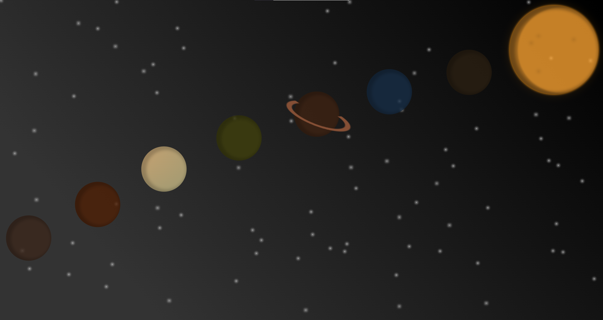

# Galaxy with React with Sass



Whole galaxy created with the help <b>sass preprocessor</b> and <b>framer motion</b> library for the interactivity.

## Check it out

```
cd /gamification
npm install
npm start
```

Now you can experience the galaxy on http://localhost:3000
